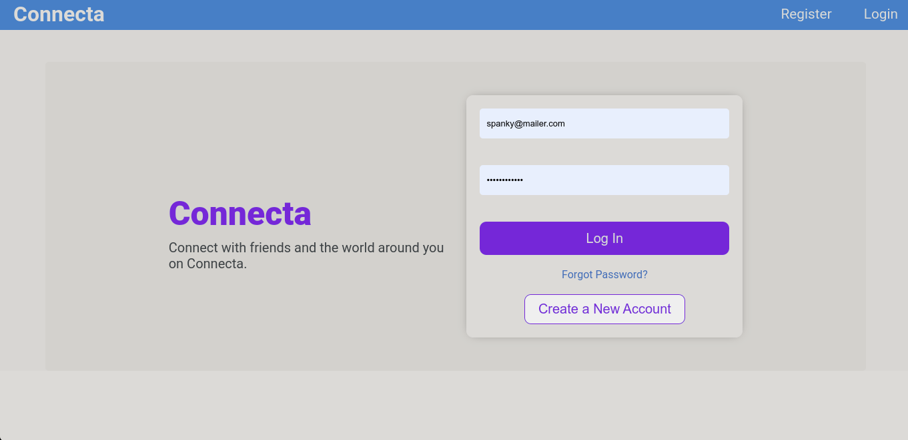

# vigo-app

## Description

Vigoapp is a full stack social media app for creating posts, connecting with friends and family, the frontend is built with React & Redux toolkit and the backend is built with Nodejs, Express, MySQL and the backend can be found [here.](https://github.com/netman5/vigo-app.git)

It is built as a requirement for the take home challenge from VigoPlace.

## Demo

## Built With

- React
- Redux toolkits
- NodeJS
- Express
- MySQL
- Git & GitHub

### Prerequisites

Internet connection and basic computing skills.

1. git clone `https://github.com/netman5/vigoapp-FE.git`

## Getting started

1. Installing the packages by running `npm install`
2. Run `npm start`

## Testing

1. On the cmd run `cd vigoapp-FE`

## Authors

👤 **Ola Ishola**

- GitHub: [@netman5](https://github.com/netman5)
- Twitter: [@Orlaish](https://twitter.com/Orlaish)
- LinkedIn: [ola-ishola](https://www.linkedin.com/in/ola-ishola/)

## 🤝 Contributing

Contributions, issues, and feature requests are welcome!

Feel free to check the [issues page](https://github.com/netman5/vigoapp-FE/issues) here 😏😏.

## Show your support

Give a ⭐️ if you like this project!

## Acknowledgments

Credits to the people at VigoPlace for the inspiration and the support.

### Special thanks

All thank to _God Almighty_ for life.

Thanks for all contributions and reviews.

## 📝 License

This project is [MIT](./MIT.md) licensed.